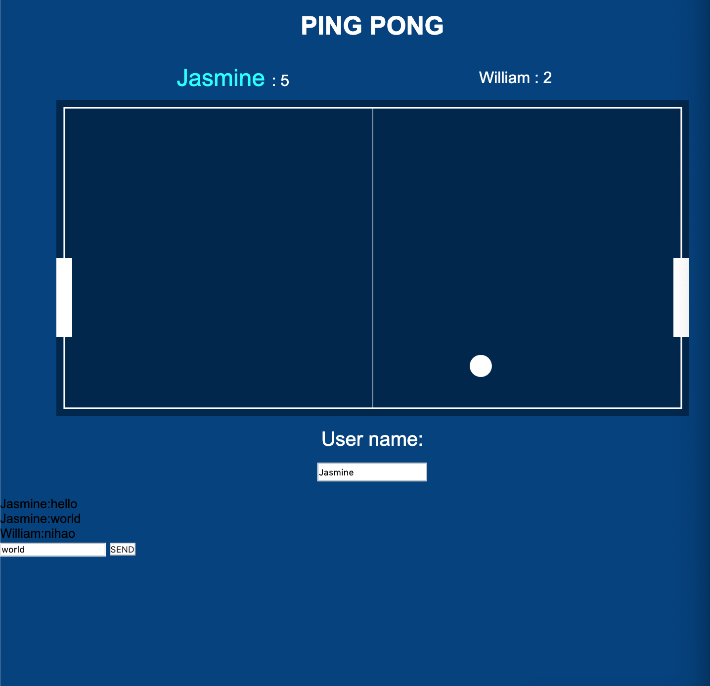
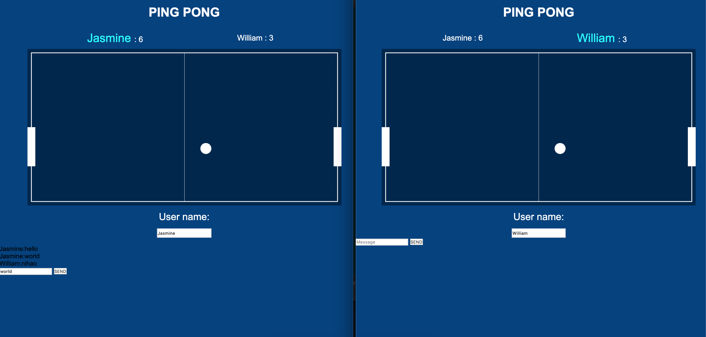

# Multiplayer-Ping-Pong

This is a 2D ping pong game created using node.js I used Socket.io to allow my game to support multiplayer.

# What do i learn form doing this?

1. Get to know Node.js
1. Npm and npx
1. What is websockets
1. SOCKET.IO
1. Collision detect
1. Canvas.
1. Pixi.js

# Features of my game

1. Input for user name.
1. score counter.
1. Two player can connect to the server and play together.
1. Keyboard control the padle.
1. The ball touches the border bounce to another derection.
1. Two player can have online chat.
